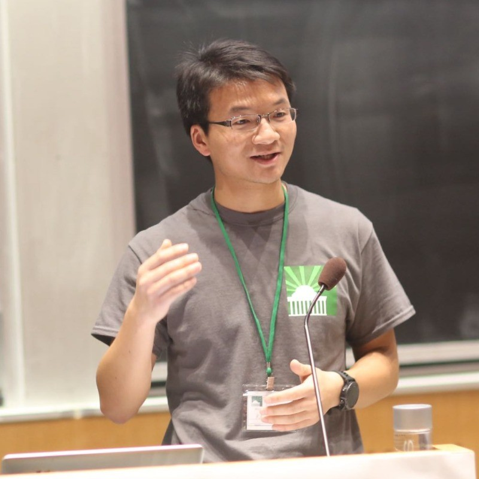

I am studying Generative AI from technology to applications at ByteDance. 

Previously, I was leading a team of engineers and PMs at Momenta.ai to build data infra and simulation for autonomous driving. Whthin my 3 years tenure, we built the largest simulation platform in China in terms of scale from scratch.

Prior to Momenta.ai, I was working on strategy & investment in AI and Infrastructure. I have also founded/co-founded various startups and organizations, including GGU Consulting, MIT CEO, MIT Energy Hackathon. 

I obtained my PhD from MIT and my bachelors from Tsinghua University. 

During my spare time, I like trail running and skiing. I am currently training for UTMB. 

<!--
In my work, I study agents.

In my life, I read, travel, rap, and play basketball.
-->
<!-- - To anyone: give me [feedback](https://www.admonymous.co/ysymyth) about anything! -->

<!--I dedicate 30 minutes per week to chat with students. Just paper plane me!  -->

<!---
# Recent News
- Sep 2023: Excited to release 🐨[CoALA](https://arxiv.org/abs/2309.02427), a systematic framework for language agents! Summary [here](https://twitter.com/ShunyuYao12/status/1699396834983362690).
- Aug 2023: I gave a [talk](https://www.bilibili.com/video/BV1ju4y1e7Em) in Chinese about ReAct, Reflexion, ToT, WebShop, InterCode, Collie. Slides [here](https://ysymyth.github.io/papers/from_language_models_to_language_agents.pdf).
- Jul 2023: I enjoyed teaching at [Princeton AI4ALL](https://ai4all.princeton.edu)! Coverage [here](https://www.today.com/video/how-the-summer-program-ai4all-is-helping-reshape-the-future-189707845651).
- Jul 2023: I wrote a [blog post](https://princeton-nlp.github.io/language-agent-impact/) with Karthik about opportunities and risks of language agents! Comment [here](https://twitter.com/ShunyuYao12/status/1683827766104408066).
<!---- Apr 2023: I attended LangChain's Agent [webinar](https://www.youtube.com/watch?v=1gRlCjy18m4). Summary [here](https://twitter.com/jh_damm/status/1646233627661828109).   --> 

# Recent Writings

- [{{ post.title }}]({{ post.url }})  
  {{ post.date | date: "%B %d, %Y" }}


# News
- [Momenta完成C轮超10亿美元融资](https://www.42how.com/article/4314)
- [Making renewable power more viable for the grid](https://news.mit.edu/2017/air-breathing-battery-making-renewable-power-more-viable-grid-1011) 
- [How some battery materials expand without cracking](https://news.mit.edu/2017/how-some-battery-materials-expand-without-cracking-0412)
- [Reducing waste and inefficiency, while increasing access and profits, propels MIT Energy Hackathon](https://news.mit.edu/2015/mit-energy-hackathon-1211)
- [电能存储项目Sodium Energy获2012 MIT－CHIEF创业大赛大奖](https://bostonese.com/2012/11/%E7%94%B5%E8%83%BD%E5%AD%98%E5%82%A8%E9%A1%B9%E7%9B%AEsodium-energy%E8%8E%B72012-mit%EF%BC%8Dchief%E5%88%9B%E4%B8%9A%E5%A4%A7%E8%B5%9B%E5%A4%A7%E5%A5%96/)

<!--
# Recent readings
* The Double Helix (James Watson)
* Lectures on General Relativity (David Tong)
* What Babies Know (Elizabeth Spelke)
* The Art of Doing Science and Engineering (Richard Hamming)
-->

<!--   
* Advice for a Young Investigator (Santiago Cajal)
* The Worlds I See (Fei-fei Li)
* Einstein: His Life and Universe (Walter Isaacson)
* Set Theory (John Burgess)
* The Computer and the Brain (John von Neumann)
* Automata Studies (Editted by C.E. Shannon and J. McCarthy)
* Team of Rivals (Doris Goodwin)
* The Linguistics Wars (Randy Harris)
 -->
<!-- * A Simpler Life (The School of Life)
* Elon Musk (Walter Isaacson)
* The Search (John Battelle) -->
<!-- * Leadership: In Turbulent Times (Doris Kearns Goodwin) -->
<!-- * 置身事内 （兰小欢） -->
<!-- * The Linguistics Wars (Randy Allen Harris) -->
<!-- * Antoni Gaudí（dosde）-->
<!-- * 西方语言学史 （姚小平）-->

<!-- (last updated: Dec 2024) -->
